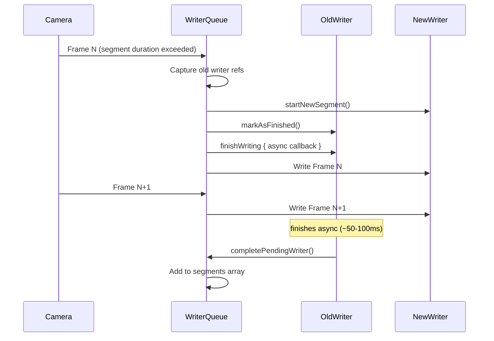
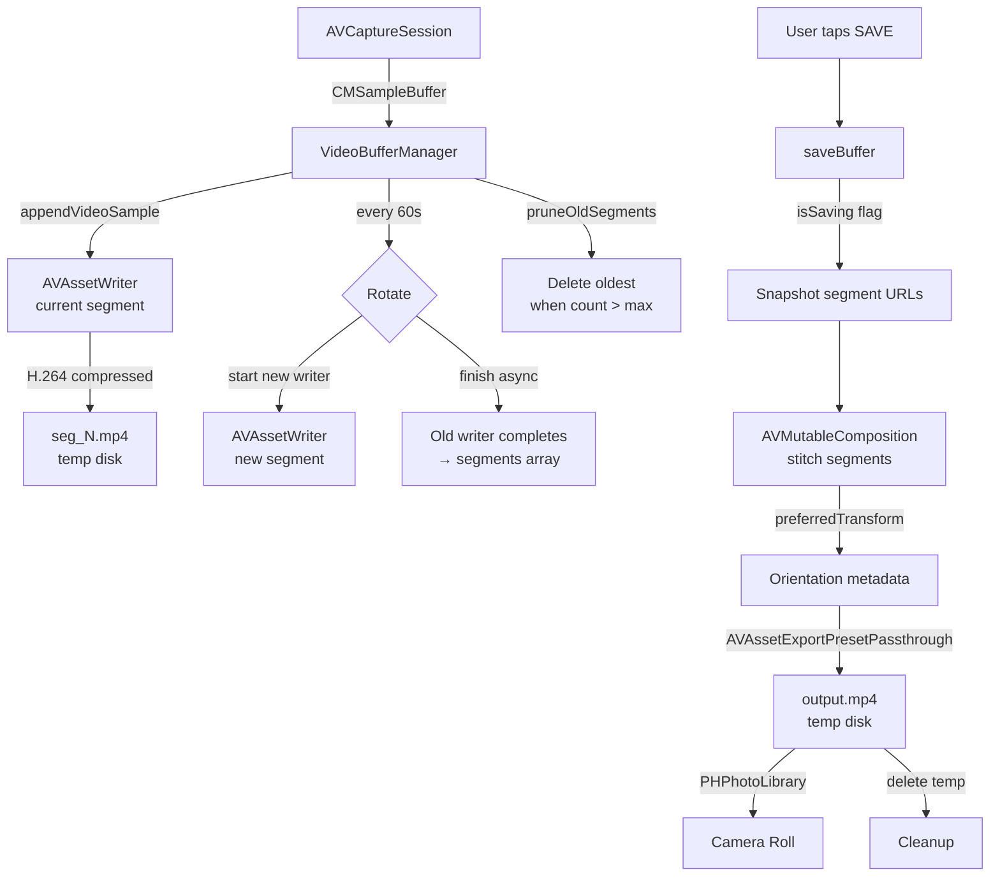

# ADR-001: Rolling Video Buffer Architecture

**Status:** Accepted  
**Date:** 2026-04-07  
**Authors:** Bernardo Cruz Rohlfs, Claude  
**Claude Code Session**: 35d49b9e-23ba-48ce-9d31-ab2a70edcecb

## Context

HighLit needs to continuously capture video and allow users to save the last 30 seconds at any moment. This requires a "rolling buffer" — a fixed-size window of video that advances in real time, discarding old content as new content arrives.

The core constraint: the buffer must be always-available, zero-friction, and work reliably for extended sessions (3+ hours) without crashing the phone or filling storage.

---

## Decision Record

### Checkpoint 1: Raw Frame Buffer (rejected)

**Approach:** Store `CMSampleBuffer` objects from `AVCaptureVideoDataOutput` in an in-memory array. Prune frames older than 30 seconds based on presentation timestamps. On save, encode all buffered frames to a file using `AVAssetWriter`.

**Outcome:** App crashed within 1 second of recording.

**Why it failed:** Each uncompressed 1080p frame is ~6MB. At 30fps, 30 seconds = ~5,400 frames = **~5.4GB of RAM**. iPhones have 4-6GB total. The app was OOM-killed almost immediately.

**Lesson:** Raw frames cannot be held in memory for any meaningful duration. The buffer must live on disk.

### Checkpoint 2: Segmented File Buffer (adopted)

**Approach:** Instead of holding frames in memory, compress video in real-time to short `.mp4` segment files on disk using `AVAssetWriter`. Maintain a rolling window of segment files, deleting the oldest as new ones complete.

```
Disk at any moment:

[seg1.mp4] [seg2.mp4] [seg3.mp4] [seg4.mp4] [seg5.mp4] [seg6 writing...]
|________________________ ~36 seconds __________________________________|

New segment finishes → oldest segment deleted → window advances
```

On save: stitch segments into one `.mp4` via `AVMutableComposition`, trim to exactly 30 seconds, export.

**Initial segment duration:** 6 seconds. This meant `ceil(30/6) + 1 = 6` segments on disk at ~30MB total.

**Outcome:** Recording worked. Memory stable. Disk bounded. But introduced new problems addressed in later checkpoints.

### Checkpoint 3: Race Condition During Export (fixed)

**Problem:** After tapping Save, segment URLs were captured, but the export ran asynchronously. During the async composition/export, `appendVideoSample` continued on the writer queue — creating new segments and calling `pruneOldSegments()`, which **deleted segment files from disk while the export was still reading them**. Result: 8-second clips instead of 30.

**First attempt (rejected):** Take ownership of segments — remove them from the array during save, delete after export. This broke the rolling buffer: after a save, the buffer was empty and had to refill from scratch.

**Adopted fix:** Copy segment files to a temporary staging directory before releasing the writer queue. The export reads from the copies; the live buffer continues rolling independently. Staging directory is cleaned up after export on all code paths (success, failure, error).

**Later replaced by** flag-based protection (Checkpoint 7).

### Checkpoint 4: Orientation Handling (evolved)

**Problem:** Saved videos appeared rotated or had 2/3 black frames.

**Iteration 1 — Fixed rotation on capture connection:**  
Set `connection.videoRotationAngle = 90` and `videoInput.transform` at setup time. Failed because orientation was locked to portrait regardless of how the phone was held.

**Iteration 2 — Save-time orientation with `AVMutableVideoComposition`:**  
Detect `UIDevice.current.orientation` at the moment of save. Apply a transform via `AVMutableVideoComposition` during export. This forced **full decode + re-encode** of every frame (2-5 seconds of export time). The hardcoded render size (1920x1080) also broke on devices with different capture resolutions.

**Iteration 3 — Dynamic dimensions + correct transform matrix:**  
Read actual `naturalSize` from the composed video track. Compute the transform from real dimensions. Fixed the black frame issue but still required re-encoding.

**Iteration 4 (current) — Metadata-only orientation:**  
Segments are written at native landscape resolution with no transform. At export time, `preferredTransform` is set on the composition track as MP4 metadata. The export uses `AVAssetExportPresetPassthrough` — no decode, no re-encode. Players (Photos, QuickTime) read the metadata to rotate for display.

UI is locked to portrait (`UISupportedInterfaceOrientations = Portrait`), and `beginGeneratingDeviceOrientationNotifications()` provides physical orientation even with a locked interface.

### Checkpoint 5: Background/Foreground State (fixed)

**Problem:** `recordingDuration` was based on wall-clock time (`Date()`). When the app went to background, the clock kept ticking but no frames were captured. On return, the UI said "30s ready" but actual recorded content was only a few seconds.

**Fix:** Observe `scenePhase` in the view. On `.background`/`.inactive`: call `stopRecording()` which flushes all segments, resets the timer. On `.active`: call `startRecording()` which begins fresh. The buffer is always empty on app entry, always accurate during use.

### Checkpoint 6: Passthrough Export (adopted)

**Problem:** Export took 4-8 seconds because `AVMutableVideoComposition` forced decode + re-encode of ~900 frames (30s at 30fps).

**Fix:** Removed `AVMutableVideoComposition` entirely. Orientation is now a `preferredTransform` on the track (metadata, not pixel manipulation). Export uses `AVAssetExportPresetPassthrough` which copies compressed H.264 packets directly. Export time dropped from 4-8 seconds to ~100-200ms.

### Checkpoint 7: Flag-Based Pruning Protection (replaced staging copy)

**Problem:** Copying ~30MB of segment files to a staging directory on every save added ~500ms-1s of I/O.

**Fix:** Instead of copying, set an `isSaving` flag before snapshotting segment URLs. `pruneOldSegments()` becomes a no-op while the flag is set. After export completes, the flag is cleared and pruning catches up via a `defer` block. During the brief save window (~1s), 0-1 extra segments may accumulate before being pruned.

This eliminated all file copying from the save path.

### Checkpoint 8: Non-Blocking Segment Rotation (adopted)

**Problem:** Every 6 seconds (later 60 seconds), segment rotation called `finishWriting` with a blocking semaphore. During the ~50-100ms block, the camera output queue was stalled and frames were dropped (`alwaysDiscardsLateVideoFrames = true`). At each boundary in the exported clip, the dropped frames appeared as visible flicker.

Additionally, each new `AVAssetWriter` creates a fresh H.264 encoder session. The first few frames have encoder warm-up artifacts (different quantization), creating another source of visual discontinuity.

**Fix — overlap rotation:**



The new writer starts **before** the old one finishes. Frame N is written to the new writer immediately — zero gap. The old writer finishes asynchronously on AVAssetWriter's internal queue. `waitForPendingWriter()` ensures at most one pending rotation exists and blocks only when explicitly needed (save or flush).

Combined with 60-second segments, most 30-second exports fall entirely within a single segment (zero boundaries). When a boundary does exist, both sides have continuous frames with no gap.

**`movieFragmentInterval`** is also set to 1 second on each writer, making files valid at any fragment boundary and reducing `finishWriting` latency.

---

## Final Architecture



### Disk Budget

| Item | Size | Lifetime |
|---|---|---|
| Rolling segments | ~60MB (2 × 60s) | Continuous, pruned automatically |
| Pending rotation segment | ~5MB | ~100ms during rotation |
| Export temp file | ~5MB | ~1 second during save |
| **Max total** | **~70MB** | |

### Save Timeline

| Step | Duration |
|---|---|
| Wait for pending writer | 0-100ms |
| Finish current segment | ~100ms |
| Load + compose segments | ~300ms |
| Passthrough export | ~100-200ms |
| Camera Roll save | ~500ms |
| **Total** | **~1-1.5 seconds** |

---

## File Cleanup Audit

Every temporary file has deletion coverage on all code paths:

| File type | Created | Deleted on success | Deleted on failure | Deleted on app kill |
|---|---|---|---|---|
| Segment `.mp4` | `startNewSegment` | `pruneOldSegments` / `flush` | `startNewSegment` catch / `finishCurrentSegmentBlocking` / `completePendingWriter` | iOS clears `tmp/` |
| Export `.mp4` | `AVAssetExportSession` | After Camera Roll save | On export error / Camera Roll error | iOS clears `tmp/` |
| Pending rotation file | `rotateSegment` | `completePendingWriter` | `completePendingWriter` (failed status) / `deleteAllSegmentFiles` | iOS clears `tmp/` |

---

## Rejected Alternatives

| Alternative | Why rejected |
|---|---|
| Raw `CMSampleBuffer` ring buffer | 5.4GB RAM for 30s, instant OOM crash |
| Single continuous file | Can't trim from front while writing; file grows unbounded |
| `AVCaptureMovieFileOutput` | No rolling buffer support; can only record to one file |
| Staging file copy for export safety | Unnecessary I/O; flag-based protection is simpler and faster |
| `AVMutableVideoComposition` for orientation | Forces full re-encode; passthrough + `preferredTransform` is ~20x faster |
| Blocking segment rotation | Drops frames at every boundary, causing visible flicker |
